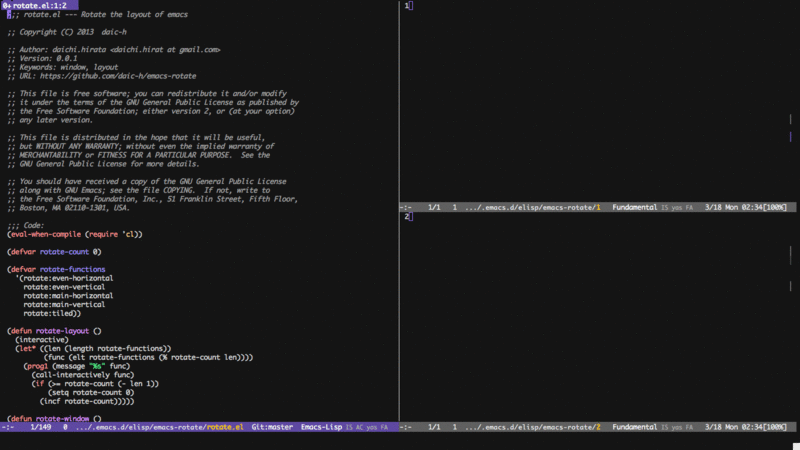
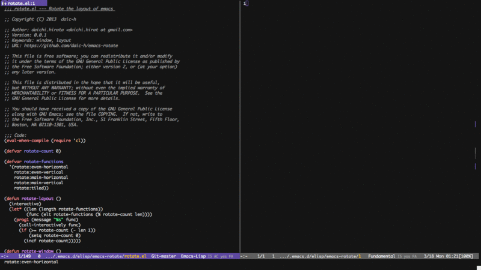
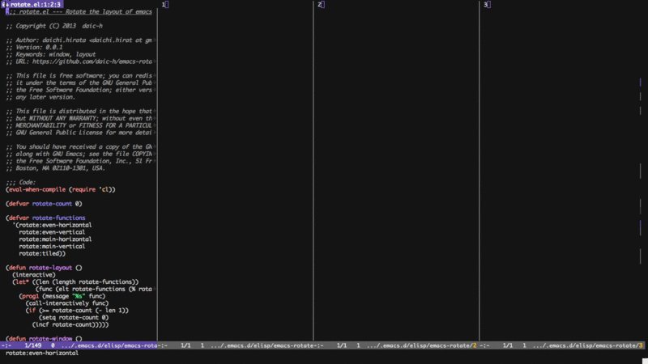

# emacs-rotate.el

## What's it

This package will help the operation for the multiple windows. 

Behavior has been prepared with reference to tmux.


## Basic Usage

#### `rotate-window`

Rotate the positions of the window.

**rotate-window**




#### `rotate-layout`

Move a window to the next layout and rearrange the window to fit.

**rotate-layout** 2 windows



**rotate-layout** 4 windows




## Customize Variables

#### `rotate-functions`

Default value is

``` 
'(rotate:even-horizontal
  rotate:even-vertical
  rotate:main-horizontal
  rotate:main-vertical
  rotate:tiled)
```

A number of preset layouts are available. These may be selected with the rotate-layout command or cycled with next-layout; once a layout is chosen, window within it may be moved and resized as normal.

By replacing this value, you can circulate freely.


## Preset layouts

The following layouts are supported:

#### `rotate:even-horizontal`

Spread out evenly from left to right across the window.

#### `rotate:even-vertical`

Spread evenly from top to bottom.

#### `rotate:main-horizontal`

A large (main) window is shown at the top of the window and the remaining windows are spread from left to right in the leftover space at the bottom. 

#### `rotate:main-vertical`

Similar to main-horizontal but the large window is placed on the left and the others spread from top to bottom along the right. 

#### `rotate:tiled`

Spread out as evenly as possible over the window in both rows and columns.


